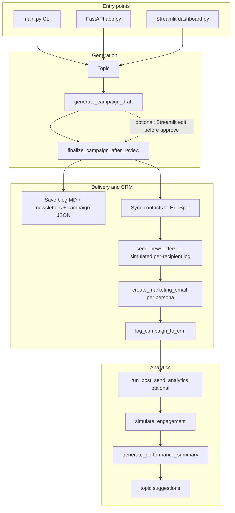

# NovaMind — AI-Powered Marketing Content Pipeline

Automated pipeline for **NovaMind**, a fictional AI product for small creative agencies: turn a blog topic into a draft, human-approved content, HubSpot marketing email assets, local campaign artifacts, and analytics summaries.

---

## Architecture overview

NovaMind is a **Python** application with three surfaces (CLI, REST API, Streamlit UI) over a shared **orchestration layer**. Content is generated with **OpenAI**, contacts and marketing emails are managed through **HubSpot’s HTTP APIs** (via `httpx`), and campaign state lives in **SQLite** plus **Markdown/JSON** files under `data/` (gitignored).

### System diagram

```
┌─────────────────────────────────────────────────────────────────────────┐
│                           NovaMind                                       │
│  ┌─────────────┐   ┌──────────────────┐   ┌────────────┐   ┌─────────┐ │
│  │ CLI / API / │   │   Orchestrator    │   │  Storage   │   │  data/  │ │
│  │  Dashboard  │──▶│ content → CRM →   │──▶│  SQLite +  │──▶│  files  │ │
│  │             │   │ distribute → KPIs │   │  file I/O  │   │         │ │
│  └─────────────┘   └─────────┬────────┘   └────────────┘   └─────────┘ │
│                              │                                           │
│                    OpenAI (gpt-4o)     HubSpot CRM / Marketing Email    │
└─────────────────────────────────────────────────────────────────────────┘
```

### End-to-end flow



**Stages in plain language**

1. **Draft** — LLM produces a blog post and three persona-specific newsletters; state is stored as `awaiting_review`.
2. **Finalize** — `run_pipeline` (CLI and `POST /pipeline/run`) finalizes **immediately** after the draft. **Streamlit** can hold the draft until you edit and approve. Finalization saves files, syncs `data/contacts.json` into HubSpot, records a **simulated** send manifest (recipient counts and log lines), creates **real** HubSpot marketing email objects (HTML from newsletter bodies), and logs the campaign on the CRM timeline.
3. **Analytics** — Persona-level engagement for the default path is **simulated** and stored; an LLM may **rewrite** a fact-grounded summary under strict guardrails. Optional **`python main.py --stats`** pulls **live** HubSpot email statistics when the campaign JSON includes `hubspot_emails` IDs.

---

## Tools, APIs, and models

| Area | Choice |
|------|--------|
| **Language** | Python (3.10+ recommended; 3.9 may work) |
| **LLM** | OpenAI API, model `gpt-4o` (`config.LLM_MODEL`) for blog, newsletters, hero image prompt path, and optional summary tone |
| **CRM / email assets** | HubSpot REST API (`https://api.hubapi.com`), private app token in `HUBSPOT_API_KEY` |
| **HTTP client** | `httpx` (HubSpot calls in `pipeline/crm_manager.py`) |
| **API server** | FastAPI + Uvicorn (`app.py`) |
| **Dashboard** | Streamlit + Plotly (`dashboard.py`) |
| **Data models** | Pydantic v2 (`models/content.py`, `models/metrics.py`) |
| **Persistence** | `aiosqlite` / SQLite URL from `DATABASE_URL`; Markdown and JSON via `storage/file_store.py` |
| **Dependencies** | See `requirements.txt` (includes `hubspot-api-client`; HubSpot integration in-repo is primarily `httpx`-based) |
| **Tests** | `pytest` |

---

## Assumptions and simulated behavior

| Topic | What the repo actually does |
|--------|-----------------------------|
| **Audience data** | Contacts are loaded from **`data/contacts.json`** (curated mock list), not a live CRM import. Sync pushes them to HubSpot for segmentation experiments. |
| **“Sending” newsletters** | `pipeline/distributor.send_newsletters` does **not** call a bulk transactional send API. It builds a **simulated** send log and segment recipient counts from persona membership — suitable for demos and tests. |
| **HubSpot marketing emails** | The pipeline **creates** marketing email objects in HubSpot (`create_marketing_email`) so IDs can be stored and used for reporting; real opens/clicks depend on your HubSpot setup and sends. |
| **Default campaign metrics** | After send, `run_post_send_analytics` uses **`simulate_engagement`** (randomized ranges per persona) when metrics are missing — not live HubSpot analytics. |
| **`METRICS_SIMULATION` in `config.py`** | Present as a flag; the main orchestration path uses simulation for stored KPIs unless you use the **CLI stats** path below. |
| **Live HubSpot stats** | `python main.py --stats <campaign_id>` calls **`fetch_hubspot_metrics`** when the campaign JSON includes **`hubspot_emails`** with valid IDs. |
| **API security** | Local FastAPI app has **no authentication** — development use only. |
| **Topic recommendations** | Dashboard can build recommendations via `pipeline/topic_recommendations.py` (analytics-driven helpers); `/suggestions/topics` uses a lightweight `suggest_topics` path over recent campaign metadata. |

---

## Run locally

### Prerequisites

- Python **3.10+** (3.9 may work)
- [OpenAI API key](https://platform.openai.com/api-keys)
- [HubSpot private app](https://developers.hubspot.com/) token with contacts and marketing email scopes as needed for your tests

### Setup

```bash
git clone https://github.com/trinhthucle17/novamind.git
cd novamind
python -m venv venv
source venv/bin/activate   # Windows: venv\Scripts\activate
pip install -r requirements.txt
```

### Environment variables

Create a **`.env`** file in the project root (this repo does not ship `.env.example`):

```env
OPENAI_API_KEY=sk-...
HUBSPOT_API_KEY=pat-na1-...
DATABASE_URL=sqlite:///novamind.db
```

### Commands

| Goal | Command |
|------|---------|
| Full pipeline (draft → finalize in one shot) | `python main.py --topic "Your blog topic"` |
| HubSpot email stats for a campaign | `python main.py --stats camp_YYYYMMDD_HHMMSS` |
| With historical comparison | `python main.py --stats camp_YYYYMMDD_HHMMSS --history` |
| REST API | `uvicorn app:app --reload --port 8000` |
| Streamlit UI | `streamlit run dashboard.py` |
| Tests | `pytest` |

### API endpoints (`app.py`)

| Method | Path | Purpose |
|--------|------|---------|
| `GET` | `/` | Health / service name |
| `POST` | `/pipeline/run` | JSON body `{"topic": "..."}` — run full pipeline |
| `GET` | `/campaigns` | List campaigns from SQLite |
| `GET` | `/content/{campaign_id}` | One campaign record |
| `GET` | `/analytics/{campaign_id}` | Metrics + AI summary |
| `GET` | `/suggestions/topics` | Suggested next topics from recent campaigns |

Example:

```bash
curl -X POST http://localhost:8000/pipeline/run \
  -H "Content-Type: application/json" \
  -d '{"topic": "AI in creative automation"}'
```

### Project layout (high level)

```
novamind/
├── main.py                 # CLI
├── app.py                  # FastAPI
├── dashboard.py            # Streamlit
├── config.py               # Env + personas + model name
├── pipeline/               # orchestrator, content, CRM, distributor, analytics, topic_recommendations
├── models/                 # Pydantic schemas
├── storage/                # SQLite + file store
├── data/contacts.json      # Mock contacts (tracked)
├── data/campaigns/         # Generated JSON (gitignored)
├── data/content/           # Generated markdown (gitignored)
├── tests/
└── docs/architecture.md    # Deeper design notes
```

### Personas (newsletter variants)

Three segments defined in `config.py`: **Creative Professionals**, **Brand Strategists**, and **Account Managers** — each gets its own newsletter voice and format rules.

---

## License

Built as a portfolio / assessment-style project; not intended as production software without hardening (auth, secrets management, real send semantics, and observability).
