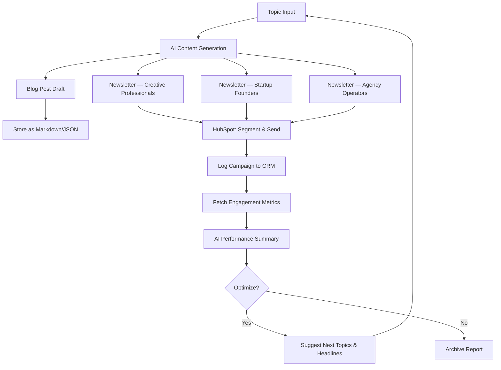

# NovaMind — AI-Powered Marketing Content Pipeline

An automated marketing pipeline that generates, distributes, and optimizes blog and newsletter content using AI and CRM integrations. Built for **NovaMind**, a fictional early-stage AI startup helping small creative agencies automate their daily workflows.

---

## Table of Contents

- [Architecture Overview](#architecture-overview)
- [Pipeline Flow](#pipeline-flow)
- [Features](#features)
- [Tech Stack](#tech-stack)
- [Project Structure](#project-structure)
- [Getting Started](#getting-started)
- [Configuration](#configuration)
- [Usage](#usage)
- [Target Personas](#target-personas)
- [API Endpoints](#api-endpoints)
- [Performance Analytics](#performance-analytics)
- [Assumptions & Design Decisions](#assumptions--design-decisions)

---

## Architecture Overview

```
┌─────────────────────────────────────────────────────────────────────┐
│                        NovaMind Pipeline                            │
│                                                                     │
│  ┌──────────┐    ┌──────────────┐    ┌──────────┐    ┌───────────┐ │
│  │  Topic    │───▶│ AI Content   │───▶│ CRM &    │───▶│ Analytics │ │
│  │  Input    │    │ Generation   │    │ Delivery │    │ & Logging │ │
│  └──────────┘    └──────────────┘    └──────────┘    └───────────┘ │
│       │               │                   │                │       │
│       │          OpenAI API          HubSpot API      Feedback     │
│       │               │                   │             Loop       │
│       └───────────────┴───────────────────┴───────────────┘       │
│                         Optimization Loop                          │
└─────────────────────────────────────────────────────────────────────┘
```

The pipeline operates in four stages:

1. **Ingestion** — Accept a blog topic and optional parameters.
2. **Generation** — Produce a blog draft and three persona-targeted newsletter variants via LLM.
3. **Distribution** — Sync contacts to HubSpot, segment by persona, and send personalized newsletters.
4. **Analysis** — Collect engagement metrics, generate AI-powered performance summaries, and feed insights back into future content.

---

## Pipeline Flow



---

## Features

### Core

- **AI Content Generation** — Generates a blog outline, a 400–600 word draft, and three persona-customized newsletter variants from a single topic input.
- **CRM Integration** — Creates/updates contacts in HubSpot, segments by persona, and distributes the correct newsletter version to each segment.
- **Campaign Logging** — Records blog title, newsletter ID, send date, and persona mapping to HubSpot for every campaign.
- **Performance Analysis** — Fetches (or simulates) open rate, click rate, and unsubscribe rate per persona; stores historical data; generates AI-powered summaries with actionable recommendations.

### Bonus

- **AI-Driven Optimization** — Suggests next blog topics and headline variations based on engagement trends.
- **Revision Workflow** — Generates multiple copy options per newsletter with the ability to request AI revisions.
- **Web Dashboard** — Simple UI to trigger the pipeline, view generated content, and browse analytics.

---

## Tech Stack

| Layer              | Technology                          |
| ------------------ | ----------------------------------- |
| Language           | Python 3.11+                        |
| AI / LLM           | OpenAI API (`gpt-4o`)              |
| CRM                | HubSpot API (free developer account)|
| Web Framework      | FastAPI                             |
| Frontend Dashboard | Streamlit                           |
| Data Storage       | SQLite (local) / JSON flat files    |
| Task Orchestration | Python `asyncio`                    |
| Testing            | pytest                              |

---

## Project Structure

```
novamind/
├── README.md
├── requirements.txt
├── .env.example
├── config.py                  # Central configuration & env loading
├── main.py                    # CLI entrypoint for the pipeline
├── app.py                     # FastAPI server (API endpoints)
├── dashboard.py               # Streamlit dashboard
│
├── pipeline/
│   ├── __init__.py
│   ├── orchestrator.py        # End-to-end pipeline coordination
│   ├── content_generator.py   # LLM-powered blog & newsletter generation
│   ├── crm_manager.py         # HubSpot contact & campaign management
│   ├── distributor.py         # Newsletter sending logic
│   └── analytics.py           # Metrics collection & AI summaries
│
├── models/
│   ├── __init__.py
│   ├── content.py             # Blog, Newsletter, Campaign data models
│   └── metrics.py             # Performance metric schemas
│
├── storage/
│   ├── __init__.py
│   ├── database.py            # SQLite persistence layer
│   └── file_store.py          # Markdown/JSON file output
│
├── data/
│   ├── contacts.json          # Mock contact list
│   ├── campaigns/             # Generated campaign logs
│   └── content/               # Generated blog & newsletter files
│
├── tests/
│   ├── test_content_generator.py
│   ├── test_crm_manager.py
│   ├── test_distributor.py
│   └── test_analytics.py
│
└── docs/
    └── architecture.md        # Detailed design document
```

---

## Getting Started

### Prerequisites

- Python 3.11 or higher
- An [OpenAI API key](https://platform.openai.com/api-keys)
- A [HubSpot developer account](https://developers.hubspot.com/) (free tier works)

### Installation

```bash
# Clone the repository
git clone https://github.com/trinhthucle17/novamind.git
cd novamind

# Create and activate a virtual environment
python -m venv venv
source venv/bin/activate        # macOS/Linux
# venv\Scripts\activate         # Windows

# Install dependencies
pip install -r requirements.txt

# Set up environment variables
cp .env.example .env
# Edit .env with your API keys
```

### Environment Variables

Create a `.env` file in the project root:

```env
OPENAI_API_KEY=your-openai-api-key
HUBSPOT_API_KEY=your-hubspot-api-key
DATABASE_URL=sqlite:///novamind.db
```

---

## Configuration

All configurable parameters live in `config.py`:

| Parameter               | Default                | Description                                    |
| ----------------------- | ---------------------- | ---------------------------------------------- |
| `LLM_MODEL`             | `gpt-4o`              | OpenAI model for content generation            |
| `BLOG_WORD_COUNT`        | `500`                 | Target word count for blog drafts              |
| `NEWSLETTER_VARIANTS`    | `3`                   | Number of persona-targeted newsletter versions |
| `HUBSPOT_BASE_URL`       | HubSpot API v3 URL    | CRM API base URL                               |
| `METRICS_SIMULATION`     | `True`                | Use simulated metrics when no live data exists |

---

## Usage

### Run the Full Pipeline (CLI)

```bash
python main.py --topic "AI in creative automation"
```

This will:
1. Generate a blog post draft and three newsletter variants.
2. Sync contacts and segment by persona in HubSpot.
3. Send the appropriate newsletter to each segment.
4. Collect engagement metrics and produce an AI performance summary.

### Run the API Server

```bash
uvicorn app:app --reload --port 8000
```

### Launch the Dashboard

```bash
streamlit run dashboard.py
```

---

## Target Personas

The pipeline segments audiences into three personas, each receiving a tailored newsletter:

| Persona                   | Description                                                                 | Newsletter Tone                    |
| ------------------------- | --------------------------------------------------------------------------- | ---------------------------------- |
| **Creative Professionals** | Freelance designers, writers, and video editors looking to save time.       | Inspirational, tool-focused        |
| **Startup Founders**       | Early-stage founders seeking to scale operations without hiring.            | ROI-driven, concise, data-backed   |
| **Agency Operators**       | Small agency owners managing multiple client workflows.                     | Practical, workflow-oriented       |

---

## API Endpoints

| Method | Endpoint                     | Description                              |
| ------ | ---------------------------- | ---------------------------------------- |
| POST   | `/pipeline/run`              | Trigger the full pipeline with a topic   |
| GET    | `/content/{campaign_id}`     | Retrieve generated content for a campaign|
| GET    | `/campaigns`                 | List all campaigns                       |
| GET    | `/analytics/{campaign_id}`   | Get performance metrics for a campaign   |
| POST   | `/content/revise`            | Request AI revision of a newsletter draft|
| GET    | `/suggestions/topics`        | Get AI-suggested next blog topics        |

### Example: Trigger the Pipeline

```bash
curl -X POST http://localhost:8000/pipeline/run \
  -H "Content-Type: application/json" \
  -d '{"topic": "AI in creative automation"}'
```

**Response:**

```json
{
  "campaign_id": "camp_20260414_001",
  "blog": {
    "title": "How AI Is Reshaping Creative Automation in 2026",
    "word_count": 523,
    "file": "data/content/blog_20260414.md"
  },
  "newsletters": [
    {
      "persona": "creative_professionals",
      "subject_line": "Your Creative Workflow, Supercharged by AI",
      "status": "sent"
    },
    {
      "persona": "startup_founders",
      "subject_line": "Cut Costs, Not Corners: AI Automation for Lean Teams",
      "status": "sent"
    },
    {
      "persona": "agency_operators",
      "subject_line": "Run Your Agency on Autopilot with AI Workflows",
      "status": "sent"
    }
  ],
  "contacts_synced": 150,
  "campaign_logged": true
}
```

---

## Performance Analytics

After each campaign, the system collects and analyzes:

| Metric            | Description                                |
| ----------------- | ------------------------------------------ |
| Open Rate         | Percentage of recipients who opened        |
| Click Rate        | Percentage who clicked a link              |
| Unsubscribe Rate  | Percentage who unsubscribed                |
| Conversion Rate   | Percentage who completed a target action   |

### AI-Generated Summary Example

> **Campaign: "AI in Creative Automation" — Performance Summary**
>
> Creative Professionals had a 12% higher click rate than other segments, driven by the visual case study in the CTA section. Startup Founders showed strong open rates (42%) but lower engagement — consider shorter copy with inline metrics. Agency Operators had the lowest unsubscribe rate (0.3%), suggesting strong content-audience fit.
>
> **Recommendations:**
> - Next topic: "5 Automation Workflows Every Small Agency Needs in 2026"
> - A/B test shorter subject lines for the Startup Founders segment
> - Add more visual assets to the Creative Professionals variant

---

## Assumptions & Design Decisions

| Area                  | Decision                                                                                                  |
| --------------------- | --------------------------------------------------------------------------------------------------------- |
| **CRM Data**          | Mock contacts are used via `data/contacts.json`. In production, these would sync from a live HubSpot CRM. |
| **Email Delivery**    | Newsletters are sent through HubSpot's transactional email API. In dev mode, sends are simulated and logged locally. |
| **Metrics**           | Engagement data is simulated with realistic distributions when live HubSpot analytics aren't available.   |
| **LLM Provider**      | OpenAI is used by default; the `content_generator.py` module is provider-agnostic and can be swapped for Claude or Gemini. |
| **Storage**           | SQLite for structured campaign/metric data; Markdown and JSON files for generated content. No external database required. |
| **Authentication**    | API keys are loaded from environment variables. The local API server does not enforce auth (dev-only).    |
| **Rate Limiting**     | Basic retry logic with exponential backoff is applied to all external API calls.                          |

---

## License

This project is developed as a take-home assessment and is not intended for production use.
