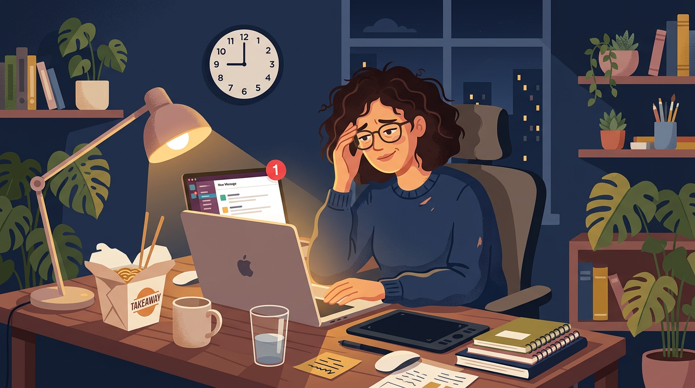

# The Agency Work-Life Balance Myth (and the 20+ Hours of AI Automation That Could Make It Real)

## Outline

- The 9 PM Slack Ping (And Other Agency Horror Stories)
- Where Do the Hours Actually Go?
- Admin & Reporting: Your Intern Pulls the Data, You Tell the Story
- Content & Campaign Work: Your Intern Writes the First Draft, You Make It Brilliant
- Client & Lead Management: Your Intern Follows Up, You Build Relationships
- What Would You Do With an Extra Day?

---

# The Agency Work-Life Balance Myth (and the 20+ Hours of AI Automation That Could Make It Real)

## The 9 PM Slack Ping (And Other Agency Horror Stories)

There's a running joke in every creative agency: work-life balance is that thing you read about on LinkedIn while eating dinner at your desk at 8 PM. You got into this industry to *create*, to design brands, write copy that moves people, produce videos that stop the scroll. Instead, you're spending your Tuesday pulling data for a client report, chasing an invoice from three weeks ago, and writing your fourth "just checking in!" email to a client who ghosted the feedback round.

Sound familiar? You're not lazy. You're not bad at time management. You have a workflow problem, and [research shows](https://blueneuronlabs.com/blog/how-marketing-agencies-can-save-20-plus-hours-per-week-using-ai-workflows) it's eating over 20 hours of your week.

## Where Do the Hours Actually Go?

When you break down a typical week at a small creative agency, the time lost to non-creative work is staggering. Here's where those hours actually disappear:

| Task Category              | Hours Per Week | What It Looks Like                                              |
|----------------------------|:--------------:|-----------------------------------------------------------------|
| **Admin & reporting**      | 9–12 hrs       | Client reports, status updates, scheduling, file organization, time tracking |
| **Content & campaign work**| 6–10 hrs       | Campaign analysis, proposal drafts, content repurposing, SEO tweaks |
| **Client & lead mgmt**    | 3–5 hrs        | Lead qualification, follow-up emails, CRM updates, intake forms |

That's **18–27 hours per week** spent on work that isn't the reason your agency exists. At the midpoint, that's over 20 hours, nearly three full workdays of busywork every single week.

Before we go further, let's be clear about what AI is *not* doing here. It's not replacing your strategist, your designer, or your account lead. Think of it more like a smart intern: one that never sleeps, never forgets to update the CRM, and can draft a first version of almost anything in seconds. You still make the decisions. AI just handles the busywork so you don't have to.

## Admin & Reporting: Your Intern Pulls the Data, You Tell the Story

This is where AI earns its keep fastest. Instead of spending your morning pulling numbers from Google Analytics, Meta, and your email platform into a slide deck, AI can aggregate data across platforms and generate a structured report draft automatically. Need a weekly status update? AI writes it from your project management tool so you just review and hit send. File organization, time-tracking summaries, meeting scheduling: these are all pattern-based tasks that AI handles instantly. You're not losing strategic oversight. You're losing the copy-paste.

## Content & Campaign Work: Your Intern Writes the First Draft, You Make It Brilliant

AI won't come up with your next big creative concept. That's your job. But it can write a solid first draft of a blog post, generate five subject line variations for A/B testing, repurpose a case study into social captions for three platforms, and analyze campaign performance data to flag what's working and what isn't. It's the difference between starting from a blank page and starting from a 70% draft. You still bring the brand voice, the taste, the judgment. AI just gets you to the starting line faster so you can spend your energy on the work that actually requires a human brain.

## Client & Lead Management: Your Intern Follows Up, You Build Relationships

The relationship is yours. AI can't replace the trust you build in a client call. But it *can* handle the mechanics around it. Scoring inbound leads so your team focuses on the right ones first. Drafting follow-up emails when a client hasn't responded to a feedback request in 48 hours. Keeping your CRM updated after every interaction without manual data entry. Even summarizing meeting notes into action items and sending them to the right people. Your account managers stay the strategic partner. AI just makes sure nothing falls through the cracks between conversations.

## What Would You Do With an Extra Day?

Twenty-plus hours is nearly three workdays. With the right AI collaborator handling the repetitive work, that time goes back to the things that actually grow your agency:

- Your creatives spend more time designing and less time organizing files
- Your strategists focus on insights instead of formatting decks
- Your account managers build real relationships instead of writing status updates
- And maybe, just maybe, everyone leaves by 6 PM

The agency work-life balance myth doesn't have to stay a myth. It just needs a really good intern.

At NovaMind, we're building that intern, the automation layer that gives creative agencies their time back, without replacing the people who make the work great.

*Ready to reclaim your 20+ hours? [Get started with NovaMind →](#)*
