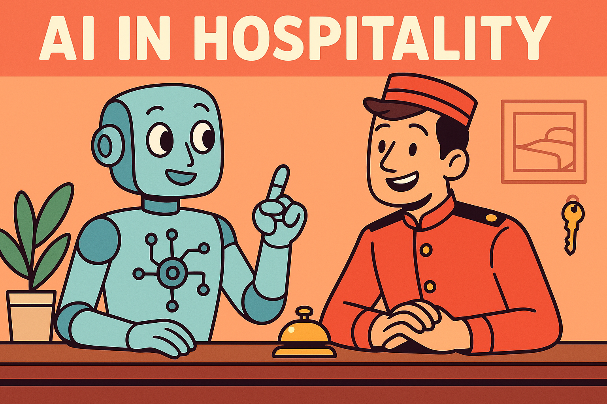

# AI in Hospitality: Your Secret Concierge, Not Your Competitor

## Outline

---

### The Busy Hotelier's Dilemma

Picture this: The front desk bell is ringing non-stop, the phone's buzzing with guest inquiries, and the line at check-in seems never-ending. Meanwhile, you're in the back office, juggling room allocations, managing overbookings, and making sure the VIP guest's room has those extra fluffy pillows they requested. If you've ever wondered if your job title should be "Professional Plate Spinner," you're not alone.

### Where the Hours Disappear

In the bustling world of hospitality, time slips away like sand through your fingers. According to a study by Skift, hospitality managers spend up to 40% of their time on administrative tasks. That's nearly half your workweek buried in spreadsheets, emails, and logistical nightmares. It's no wonder you're left wondering where the day went.

### The AI Concierge: Your New Best Friend

Enter AI, your new secret concierge. Think of it as the ultimate assistant that never needs a coffee break. AI can handle the mundane yet essential tasks like booking management, guest communication, and even personalized service recommendations. Expect to reclaim approximately 4-6 hours a week on tasks like guest follow-ups and booking adjustments.

#### What Type of Hotelier Are You?

Take this quick quiz to find out:

1. When a guest asks for a restaurant recommendation, do you:
   - A) Pull out a list of pre-approved local spots.
   - B) Ask them about their tastes and make a personalized suggestion.

2. Your favorite part of the job is:
   - A) The routine of daily operations.
   - B) The surprise and delight of guest interactions.

3. When an unexpected issue arises, you:
   - A) Stick to protocol.
   - B) Think creatively and adjust on the fly.

4. You see AI as:
   - A) A tool to streamline operations.
   - B) A partner in creating memorable experiences.

### Reclaiming Your Hospitality Superpowers

With AI taking care of the groundwork, imagine what you could do with those extra hours each week. You might finally have time to craft the kind of personalized guest experiences that make your hotel the talk of the town. Or perhaps you'll dive into strategic planning, shaping the future of your operations. And hey, maybe you'll even get to leave the office before sunset and enjoy a leisurely dinner at home.

### AI: The Helpful Hand, Not the Star

Rest easy, hospitality heroes. AI isn't here to steal your job, but to enhance your ability to do what you do best. It's like having a super-efficient intern who handles the repetitive tasks, freeing you to focus on the human elements that make your role irreplaceable — your judgment, your creativity, and the unique relationships you build with guests.

In the ever-evolving landscape of hospitality, AI is your ally in creating unforgettable experiences. So embrace the possibilities and get ready to elevate your service to new heights.
